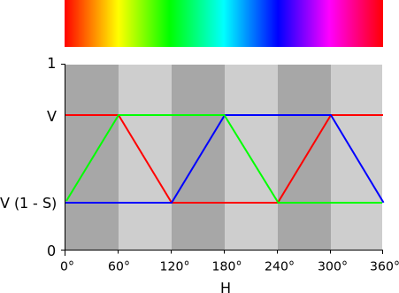

# Rainbow

Zeigt auf der RGB-LED vom Calliope-Board im Verlauf von eingen Sekunden alle Regenbogenfarben an.

## Zur Funktionsweise

Das Programm zählt eine globale Variable "step" hoch, bis sie einen Grenzwert erreicht und setzt sie dann wieder auf 0 zurück.

In Abhängigkeit von dem Wert dieser globale Variable "step" werden 3 Werte berechnet, die dann als Rot-, Grün- und Blau-Werte für die Farbe verwendet werden, die mit der RGB-LED vom Calliope angezeigt wird.

Zur Berechnung der Rot-, Grün- und Blau-Werte gibt es 6 verschiedene Abschnitte, wie in diesem Bild zu erkennen:

https://upload.wikimedia.org/wikipedia/commons/5/5d/HSV-RGB-comparison.svg

Zunächst ist Rot bei voller Leuchtstärke (255) und Grün und Blau abgeschaltet (0).

In den ersten 255 Schritten wir der Wert für Grün langsam vergrößert.

Wenn Grün dann bei voller Leuchtstärke (255) angekommen ist, wir Rot langsam immer dunkler.

Danach wird Blau von 0 bis 255 Schrittweise heller.

Die weiteren 3 Schritte sind sozusagen das Gleiche, nur umgekehrt.

## Zu den verwendeten Konstanten im Code

**255** ist die größte darstellbare Ganzzahl mit 8 Bit, denn mit 8 Bit kann man 2^8=**256** verschiedene Zustände darstellen. So zum Beispiel die Ganzzahlen von 0 bis 255.

Die globale Variable "step" läuft von 0 bis 6*256-1=**1535** (Zeile 36).

1*256-1=**255**, 2*256-1=**511**, 3*256-1=**767**, 4*256-1=**2013** und 5*256-1=**1279** sind die Grenzen der Abschnitte für zu verwendenden Formeln der 3 Helligkeitswerte *(Zeilen 40, 45, 50, 55 und 59)*.

0*256=**0**, 2*256=**512** und 4*256=**1024** sind Einstiegspunkte bei Rot, Grün und Blau *(Zeilen 24, 28 und 32)*.

Die globale Variable "tmp" bekommt Werte zwischen 0 und 255 zugewiesen (Rest beim Teilen durch 256, *Zeile 39*).

Den Weiß-Wert setzten wir auf 0 *(Zeile 71)*.

Wir warten zusätzlich 2 mSek vor jedem Farbwechsel um die Animation etwas langsamer zu machen *(Zeile 72)*.
